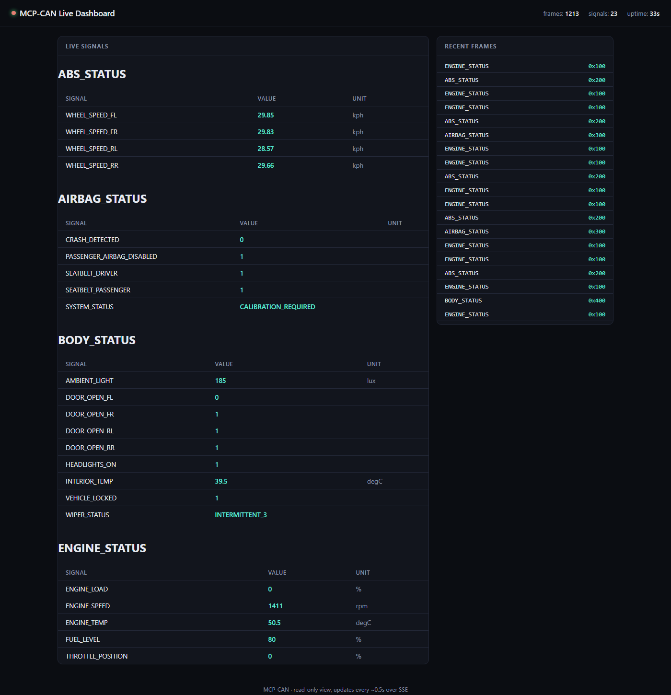

# 🚗 MCP-CAN: Bridging Vehicle Data to LLMs via MCP


🔌 Virtual CAN + MCP Server

An MCP server purpose-built to surface vehicle CAN/OBD data to an LLM/SLM. It simulates ECUs on a virtual CAN bus, decodes via a DBC, and exposes MCP tools over SSE (or streamable-HTTP), no hardware required by default.

---

## ✨ Highlights
- MCP server for CAN/OBD/UDS-diagnostics → LLM/SLM (tools + DBC metadata, SSE or streamable-HTTP).
- Virtual CAN backend (python-can) out of the box; optional SocketCAN/vCAN on Linux.
- DBC-driven encoding/decoding via `cantools`.
- ECU simulator that streams multiple messages, plus OBD-II and UDS-style diagnostic responders.
- Correlated driving-dynamics signal generation, plus named fault-injection scenarios (`overheat`, `abs_fault`, `low_fuel`) with matching DTCs.
- Typer CLI: `mcp-can` (simulate, server, demo, frames, decode, monitor, dbc-info, obd-request, diag-request, fault).
- Structured tool output (typed Pydantic models), duration-capped tool calls, `/healthz`, colorized logging.
- Read-only live web dashboard (`/dashboard`): signal values and recent frames, updated over SSE.
- Dockerfile + docker compose for server + simulator.
- Unit tests, type hints, lint config (ruff, mypy); see `CONTRIBUTING.md`.

## 📁 Repository Layout
- `src/mcp_can/`
  - `cli.py` – Typer commands
  - `bus.py` – python-can helpers
  - `dbc.py` – DBC loading/decoding
  - `obd.py` – OBD-II (SAE J1979) request/response helpers
  - `diagnostics.py` – UDS-style diagnostic service/response-code logic
  - `config.py` – env settings (`MCP_CAN_*`) + logging setup
  - `models.py` – internal bus-layer dataclass (`Frame`)
  - `simulator/runner.py` – ECU simulator + OBD/diagnostic responders
  - `simulator/state.py` – correlated driving-dynamics state (RPM/speed/throttle/etc.)
  - `simulator/faults.py` – named fault-injection presets + activation protocol
  - `server/fastmcp_server.py` – MCP tools/resources + dashboard routes
  - `server/schemas.py` – Pydantic models for MCP tool structured output
  - `server/live_state.py` – background bus listener backing the dashboard
  - `server/templates/dashboard.html` – the dashboard page itself
- `vehicle.dbc` – sample CAN database (incl. a UDS-like diagnostic schema)
- `simulate-ecus.py`, `can-mcp.py` – standalone run-without-installing entrypoints
- `docker/compose.yml`, `Dockerfile`
- `tests/` – unit tests
- `CONTRIBUTING.md`, `CHANGELOG.md`

## ✅ Prerequisites
- Python 3.10+
- (Optional) Docker / Docker Compose
- (Optional) Ollama if you want a local LLM backend

## 📦 Install (Python)
From repo root:
```bash
pip install -r requirements.txt
pip install -e .
```

## 🚀 Quickstart (Simulator + MCP Server)
Two terminals:
```bash
# Terminal A: start ECU simulator on virtual bus0
mcp-can simulate

# Terminal B: start MCP server (SSE on 6278)
mcp-can server --port 6278
```

Single-process (helps on Windows if virtual backend doesn't share across processes):
```bash
mcp-can demo --port 6278
```

Sample interactions:
```bash
mcp-can frames --seconds 2
mcp-can decode 0x100 "01 02 03 04 05 06 07 08"       # pretty table by default, --json for scripting
mcp-can dbc-info                                      # table of every message/signal in the DBC
mcp-can monitor ENGINE_SPEED --seconds 3
mcp-can obd-request --service 0x01 --pid 0x0D
mcp-can diag-request --service-id 0x22 --parameter-id 0x05   # READ_DATA_BY_ID
```

## 📊 Live Dashboard
With `mcp-can demo` (or `server`) running, open `http://localhost:6278/dashboard` in a browser: live signal values grouped by ECU message, and a scrolling feed of recent frames, updating ~2x/second over Server-Sent Events. It's read-only (view only, no controls to send frames) and self-contained: no build step, no external assets, works offline. Like everything bus-related here, it only shows data when the simulator shares the *same process* as the server (`mcp-can demo`); pointed at a bare `mcp-can server` with no simulator, it just shows "waiting for CAN traffic."



## 🛠️ Available MCP Tools & Resources
| Name | Type | Description |
|---|---|---|
| `read_can_frames` | tool | Raw frames from the last `duration_s` seconds. Returns instantly (served from a continuously-running history buffer, not a fresh listen window). |
| `decode_can_frame` | tool | Decode one frame's bytes into named signals. |
| `filter_frames` | tool | Like `read_can_frames`, filtered by arbitration ID and/or signal. |
| `monitor_signal` | tool | Timestamped samples of one decoded signal, from the same history buffer. |
| `get_vehicle_snapshot` | tool | Last known value of every signal seen so far, one entry per signal (not per frame) with an `age_s` freshness indicator: a single-call overview instead of decoding a frame stream yourself. |
| `send_obd_request` | tool | Standard OBD-II (SAE J1979) request; decodes known PIDs (coolant temp, speed, fuel level, fuel type). |
| `send_diagnostic_request` | tool | UDS-style diagnostic request (`vehicle.dbc`'s `DIAGNOSTIC_REQUEST`); collects every ECU's response. |
| `activate_fault_scenario` | tool | Activate (or clear) a named fault-injection preset (`overheat`, `abs_fault`, `low_fuel`) in the running simulator; see below. |
| `dbc_info` | resource (`file://vehicle.dbc`) | Full DBC dump: nodes, messages, signals. |

`read_can_frames`/`filter_frames`/`monitor_signal` are served from a single continuously-running history buffer (`server/live_state.py`) rather than each opening its own bus listener: they return immediately and won't miss frames sent between calls. `send_obd_request`/`send_diagnostic_request` are request/response and still wait live for a reply. In both cases, `duration_s`/`timeout_s` is capped by `MCP_CAN_MAX_DURATION_S` (default 30s; the history buffer retains at least that much, or 60s, whichever is larger). All tools return typed, structured content (see `server/schemas.py`) rather than ad-hoc JSON.

### 🩺 About the diagnostic responder
`vehicle.dbc` defines a UDS-like diagnostic schema: `DIAGNOSTIC_REQUEST` (one shared request frame) and four `DIAGNOSTIC_RESPONSE_<ECU>` messages, one per ECU, but the request has no per-ECU target field. The simulator treats every request as functionally addressed to *all four* ECUs, so `send_diagnostic_request`/`diag-request` may return more than one response. Supported services: `START_DIAGNOSTIC_SESSION` (0x10) and `RESET_ECU` (0x11) are acknowledged OK; `READ_DATA_BY_ID` (0x22) returns a deterministic canned value derived from the parameter ID; `ROUTINE_CONTROL`/`READ_MEMORY`/`WRITE_MEMORY` and anything unrecognized return `SERVICE_NOT_SUPPORTED`; see `diagnostics.py::handle_service`.

### ⚠️ Fault injection
Three named scenarios (`simulator/faults.py::PRESETS`) let you force the simulator into a specific fault state instead of waiting on random signal generation:
- `overheat` – `ENGINE_TEMP` pinned to its hottest reportable value, `SYSTEM_STATUS` set to `FAULT_PRESENT`, DTC `P0217` (Engine Overtemp Condition).
- `abs_fault` – all four `WHEEL_SPEED_*` signals stuck at zero, `SYSTEM_STATUS` set to `FAULT_PRESENT`, DTC `C0035` (Left Front Wheel Speed Sensor Circuit).
- `low_fuel` – `FUEL_LEVEL` pinned critically low; no DTC (a low-fuel light isn't a stored trouble code on a real vehicle either).

Activating a scenario sends a small control frame on the bus (like OBD/diagnostic requests, this is a round trip to whichever process is running the simulator, so it needs `mcp-can demo`/`simulate` already running) and overrides the named signals until cleared. Any DTCs the active scenario sets show up in `send_obd_request`/`obd-request`'s Mode 03 (service=3) response. Use `mcp-can fault list` or the `activate_fault_scenario` tool's docstring to see the current preset descriptions; pass `preset=None` (CLI: `clear`) to deactivate.

## 🔍 MCP Inspector (GUI for your tools)
Use the official Inspector to explore and call your MCP tools without writing a host:
```bash
npx @modelcontextprotocol/inspector
```
When prompted, connect to your server:
- URL: `http://localhost:6278/sse`

You can then list tools/resources and call one (e.g. monitor `ENGINE_SPEED` for 5 seconds) and view structured output live.

## 🤖 Using with Ollama (local LLM)
1) Ensure Ollama is running: `ollama serve` and pull a model: `ollama pull llama3`
2) Run simulator + MCP server (see Quickstart).
3) Point your MCP-capable host at `http://localhost:6278/sse` and configure its model endpoint to `http://localhost:11434` with your model name (e.g., `llama3`).
4) Prompt the host: "Monitor ENGINE_SPEED for 5 seconds", "List all DBC messages", or "Send a READ_DATA_BY_ID diagnostic request for parameter 5."

If you need a minimal host, pair `@modelcontextprotocol/sdk` with Ollama (see SDK docs) or use Inspector for manual tool calls.

Example host config (OpenAI-compatible endpoint to local Ollama):
```json
{
  "model": {
    "type": "openai-compatible",
    "baseUrl": "http://localhost:11434/v1",
    "model": "llama3"
  },
  "mcpServers": {
    "can-mcp-server": {
      "serverUrl": "http://localhost:6278/sse"
    }
  }
}
```

## ⌨️ CLI Reference
- `mcp-can simulate` – start ECU simulator using `vehicle.dbc`.
- `mcp-can server [--port 6278] [--transport sse|streamable-http|stdio]` – run the MCP server.
- `mcp-can demo [--port] [--transport]` – simulator + server in one process.
- `mcp-can frames --seconds 1.0` – capture raw frames as JSON.
- `mcp-can decode <id> <data> [--json]` – decode a single frame (table by default; `id` hex/decimal, `data` space/comma-separated bytes).
- `mcp-can snapshot --seconds 1.0 [--json]` – latest value of every signal seen while listening.
- `mcp-can dbc-info [message]` – table of every message/signal in the DBC, or just one message's.
- `mcp-can monitor <signal> --seconds 2.0 [--json]` – watch one signal (live output by default).
- `mcp-can obd-request --service <hex|int> [--pid <hex|int>]` – OBD-II request; response includes a decoded value for known PIDs.
- `mcp-can diag-request --service-id <hex|int> [--parameter-id] [--data-field]` – UDS-style diagnostic request; prints every ECU's response.
- `mcp-can fault <preset|clear|list>` – activate/clear a fault-injection scenario in a running simulator, or list available presets.

`server`/`demo`/`simulate` all print colorized logs (via `rich`) instead of raw text.

## ⚙️ Configuration
Env vars (prefix `MCP_CAN_`):
- `CAN_INTERFACE` (default `virtual`)
- `CAN_CHANNEL` (default `bus0`)
- `DBC_PATH` (default `vehicle.dbc`)
- `MCP_PORT` (default `6278`)
- `MCP_TRANSPORT` (default `sse`; `streamable-http` requires a newer `mcp` SDK; the server logs a clear error and exits if the installed version doesn't support it, rather than crashing on an SDK traceback)
- `MAX_DURATION_S` (default `30.0`) – caps every tool's `duration_s`/`timeout_s`
- `LOG_LEVEL` (default `INFO`)
- `CORS_ALLOW_ORIGINS` (default `["*"]`, JSON array e.g. `["https://your-host.example"]`) – allowed browser origins for the SSE endpoint. Credentialed requests (`allow_credentials`) are only enabled once this is narrowed to specific origins; wildcard + credentials is a combination browsers reject outright, so it's never turned on for the default `"*"`. Override before any real deployment.

You can set these in a `.env` file at repo root.

## 🐳 Docker
Build:
```bash
docker build -t mcp-can .
```
Run (combined server + simulator):
```bash
docker run -d --name mcp-can -p 6278:6278 -p 5000:5000 -p 8080:8080 mcp-can
```
Compose (from `docker/`):
```bash
docker compose up -d --build
```
> The compose file currently runs `server` and `simulator` as separate containers; like running them as two separate local processes, they won't share the virtual CAN bus unless the host provides a real shared `vcan0` interface. For a working combined setup today, use the single-container Dockerfile above (`mcp-can demo`).

## 🧪 Development & Testing
See `CONTRIBUTING.md` for the full guide. Quick version:
```bash
pip install -r requirements.txt
pip install -e .
pip install pytest ruff mypy

ruff check .
mypy src
pytest -q
```

## 🔧 Troubleshooting
- No frames? Ensure both simulator and server use the same interface/channel (`virtual`/`bus0` by default), and, on Windows, that they're the same process (`mcp-can demo`) rather than two separate ones.
- DBC missing? Set `MCP_CAN_DBC_PATH` or place `vehicle.dbc` in repo root.
- Docker networking: expose `6278` so your MCP host can reach it.
- `streamable-http` transport fails immediately? Your installed `mcp` package predates its support; the log line tells you. Switch to `sse` or `pip install -U mcp` (staying below `2.0.0`).

## 📄 License
MIT (see `LICENSE`). Educational/prototyping use only; use certified hardware for real automotive work.
